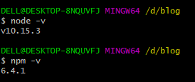
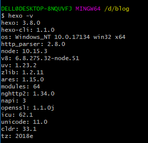
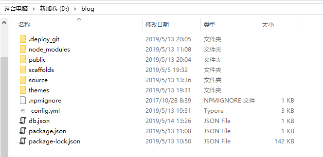
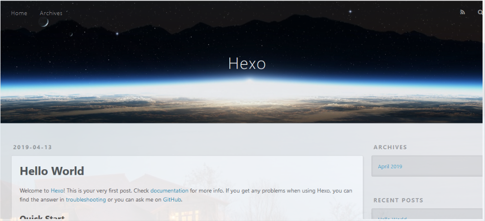
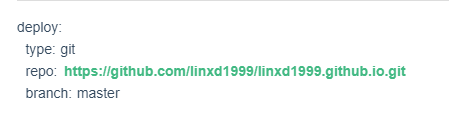

### 特别感谢up主CodeSheep的视频教程, [原视频请点击](https://www.bilibili.com/video/av44544186)

### Step1： 安装Node.js

Node.js官网下载: https://nodejs.org/en/download/

### Step2： 安装Git

Git是一个开源的分布式版本控制系统，是为了帮助管理Linux内核开发而开发的版本控制软件。

Git官网下载: https://www.git-scm.com/download/

安装完之后鼠标右击会出现Git Bash Here， 这就相当于Linux终端，我们等会对博客的操作也都是在这里完成。

<!--more-->

一些常用的Linux命令行操作：

> cd   ：进入目录
>
> cd ..：返回上一级目录
>
> cd../..：返回上两级目录
>
> pwd：显示当前路径
>
> ls -l：显示当前路径下文件的详细信息

### Step3： 安装Hexo

Hexo是一个快速，简洁，高效的博客框架。Hexo使用Markdown（或其他渲染引擎）解析文章，在几秒内，即可利用华丽的主题生成静态网页。

随便在一个盘下新建文件夹，用来操作博客用，后面我都用Blog来表示这个文件夹。

进入Blog文件夹，右键Git Bash Here，首先测试node和npm的版本。

输入命令：

然后安装一个cnpm提高下载速度：

> npm install -g cnpm --registry=https://registry.npm.taobao.org

测试cnpm：

然后安装Hexo：

> cnpm install -g hexo-cli

验证是否安装成功

> hexo -v

安装成功！

然后在根目录下执行：

> hexo init

这是建立整个项目，若Blog文件夹下出现了很多文件则说明成功了。

### Step4：运行测试

> hexo clean   清理缓存文件
>
> hexo g         生成文件
>
> hexo s         运行本地服务器
>
> hexo d         部署到远端服务器

先在根目录下运行hexo s

然后打开浏览器，输入localhost:4000，出现以下界面

至此，本地环境已经搭建好了。

### Step5：部署到Github上

登录Github，创建一个新的仓库new repository，仓库名称为你的Github ID.github.io（必须是这这样写）

然后在根目录下安装一个Git部署插件

> cnpm install --save hexo-deployer-git

在根目录下的_config.yml文件下修改一些配置

repo把打开仓库看到的那个git结尾的复制进来就好。

最后部署到远端：hexo d

之后会出现一些验证，照着提示做就可以了。

推送到远端成功后，在浏览器输入你的Github ID.github.io就可以访问博客了。